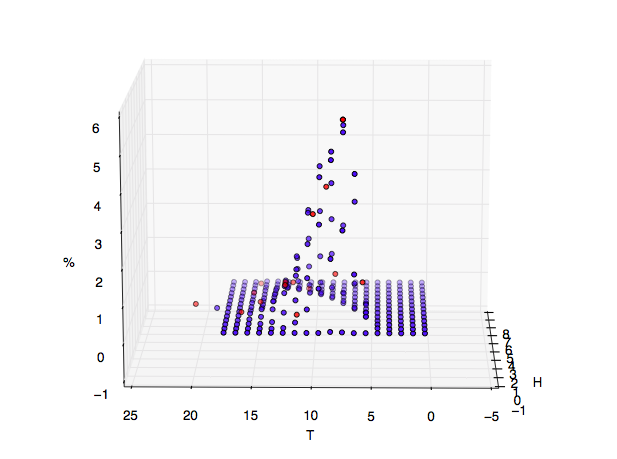

===================
Interpolate3D
===================

The following project is a Python script that is used to modify an excel document. It takes value of H (wave height) and T (wave period) from a predetermined matrix of probabilities of occurrence (percentages, normalized to 100) and interpolates the values for values not in the matrix.

This process can be generalized to n dimensional joint density data. This project was the motivation for ``py

Requirements
------------
* openpyxl_
* 

In terminal to run the program. This is the library used to read from and write to Excel documents. In the program's current form, the Excel document must have the following form:

.. math::
	==============  ==============
	H       		T     
	==============  ==============
	H_1     		T_1   
	H_2     		T_2   
	\ldots 			\ldots
	\ldots  		\ldots
	H_n     		T_n   
	==============  ==============

Run
-------
.. code-block:: python

    python interpolate.py DENSITY_MATRIX VALUES_TO_INTERPOLATE

See the tests for the formats of these documents.

This will print the values of the percentages and write these values to the third column of the Excel document.

.. math::
	==============  ==============  ============================
	H       		T       		\mathbb{P}[H, T] 
	==============  ==============  ============================ 
	H_1     		T_1     		\mathbb{P}[H_1, T_1]
	H_2     		T_2     		\mathbb{P}[H_2, T_2]
	\ldots 			\ldots  		\ldots
	\ldots  		\ldots  		\ldots
	H_n     		T_n     		\mathbb{P}[H_n, T_n]
	==============  ==============  ============================

An image displaying the joint densities from the matrix (blue) and those interpolated from this data matrix (red) is seen below.

These files have been attached in the tests and can be used for demo purposes. Note that you can substitute any Excel document for the demo one as long as it holds the format specified above.

Happy interpolating!
